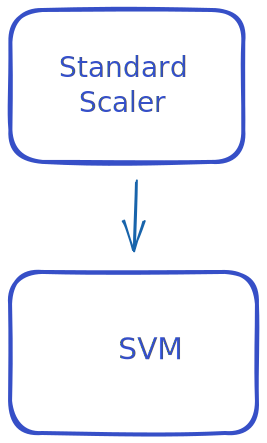

AutoML-toolkit was built to support future development of AutoML systems and
a central part of an AutoML system is its Pipeline. The purpose of this
guide is to help you understand all the utility AutoML-toolkit can
provide to help you define your pipeline. We will do this by introducing concepts
from the ground up, rather than top down.
Please see [examples](./examples) if you would rather see copy-pastable examples.

---

## Introduction

At the core of a [`Pipeline`][byop.pipeline.Pipeline] definition
is the many [`Steps`][byop.pipeline.Step] it consists of.
By combining these together, you can define a _directed acyclic graph_ (DAG),
that repesents the flow of data through your [`Pipeline`][byop.pipeline.Pipeline].
Here is one such example that by the end of this guide, you should be able
to construct.


There are a few concrete flavours that each encode the different parts of
this DAG with which we can then search over.

* [`Component`][byop.pipeline.Component]: An step of a pipeline with
  an object attached and possibly some space attached to it.
* [`Choice`][byop.pipeline.Choice]: A step which represents the a choice of which
  step(s) is next.
* [`Split`][byop.pipeline.Split]: A step which represents that the data flow
  through a pipeline will be split between the following steps. This is
  usually accompanied by some object that does the data splitting.
* [`Option`][byop.pipeline.Option] : A step which indicates the following
  step(s) are optionally included.

Once we have our pipeline definition, extracting a search space, configuring
it and building it into something useful can be done with the methods,
[`pipeline.space()`][byop.pipeline.Pipeline.space],
[`pipeline.sample()`][byop.pipeline.Pipeline.sample],
[`pipeline.configure()`][byop.pipeline.Pipeline.configure],
[`pipeline.build()`][byop.pipeline.Pipeline.build],

```python
from byop.Pipeline imort Pipeline

pipeline = Pipeline.create(...)

# Get the space for the pipeline and sample a concrete pipeline
space = pipeline.space()
config = pipeline.sample(space)

# Configure the pipeline
configured_pipeline = pipeline.config(config)

# Build the pipeline
built_pipeline = pipeline.build()
```

By the end of this guide you should be able to understand each of these
components, how to create them, modify it, and build your own
[`Pipeline`][byop.pipeline.Pipeline].

!!! Note

    This guide requires both the ConfigSpace and sklearn integrations
    to be active with `pip install sklearn configspace`
    or `pip install amltk[sklearn, configspace]`

## Components
We'll start by creating a simple `Component` for a
a [`RandomForestClassifier`][sklearn.ensemble.RandomForestClassifier],
along with its search space. We'll then
[`configure`][byop.pipeline.Component.configure] it and
[`build()`][byop.pipeline.Component.build] it into a standalone,
useable sklearn object, showing how you can get its
[`space()`][byop.pipeline.Component.space]
and [`sample()`][byop.pipeline.Component.sample]
it.


### Defining a Component
```python
from byop.pipeline import step, Component

mystep: Component = step("hello_step", object())  # (1)!
```

1. Using keywords, `#!python step(name="hello_step", item=object())`

While this particular component isn't very useful, we can highlight two important
facts, we can associate any `object` with a step and give it a `name`, in this
case `#!python "hello_step"`.

Lets create a step that will represent a Random Forest in our pipeline and set
some parameters for it.

```python
from byop.pipeline import step
from sklearn.ensemble import RandomForestclassifier

component = step("rf", RandomForestClassifier, config={"n_estimators": 10})
```

Here the `config` is the parameters we want to call `RandomForestClassifier`
with whenever we want to turn our pipeline definition into something concrete.

If at any point we want to convert this step into the actual `RandomForestClassifier`
object, we can always call [`build()`][byop.pipeline.Component.build] on the step.

```python hl_lines="5"
from byop.pipeline import step
from sklearn.ensemble import RandomForestclassifier

component = step("rf", RandomForestClassifier, config={"n_estimators": 10})
classifier = component.build()

print(classifier)

classifier.fit(...)
classifier.predict(...)
```

This by itself as you're probably noticed is a lot of work to just build a
random forest, and you're right. However the reason to wrap everything in a step
is for what comes next.


### Defining a search space

In any machine learning pipeline, we often wish to optimize some hyperparameters
of our model. For this we actually need to define some hyperparameters. For
this example, we will be using [`ConfigSpace`](../integrations/configspace.md) and
it's syntax for defining a search space, but check out our built-in
[integrations](integrations) for more.

```python hl_lines="6 7"
from byop.pipeline import step
from sklearn.ensemble import RandomForestClassifier

component = step(
    "rf",
    RandomForestClassifier,
    space={"n_estimators": (10, 100), "criterion": ["gini", "entropy"]},
)

print(component)
```

Here we've told `amltk` that we have a component that `RandomForestClassifier`
has two hyperparameters we care about, some integer called `#!python "n_estimators"`
between `#!python (10, 100)` and some choice `#!python "criterion"` from
`#!python ["gini", "entropy"]`. For the specifics of what these hyperparameters
mean, please [refer to the scikit-learn docs][sklearn.ensemble.RandomForestClassifier].

We can retrieve a space from this component by calling [`space()`] on it.

```python hl_lines="10"
from byop.pipeline import step
from sklearn.ensemble import RandomForestClassifier

component = step(
    "rf",
    RandomForestClassifier,
    space={"n_estimators": (10, 100), "criterion": ["gini", "entropy"]},
)

space = component.space(seed=1)

print(space)
```

We can sample from this space, but first we will show how you can use
[`configure()`][byop.pipeline.Component.configure] with a manually written
config to configure the component.

```python hl_lines="11"
from byop.pipeline import step
from sklearn.ensemble import RandomForestClassifier

component = step(
    "rf",
    RandomForestClassifier,
    space={"n_estimators": (10, 100), "criterion": ["gini", "entropy"]},
)

config = {"n_estimators": 15, "criterion": "gini"}
configured_component = component.configure(config)

print(configured_component)
```

To piece theses together, we can sample from the space and then configure
the component with this sampled config.

```python hl_lines="10 11"
from byop.pipeline import step
from sklearn.ensemble import RandomForestClassifier

component = step(
    "rf",
    RandomForestClassifier,
    space={"n_estimators": (10, 100), "criterion": ["gini", "entropy"]},
)

space = component.space(seed=1)
config = component.sample(space)

print(config)

configured_component = component.configure(config)

print(configured_component)
```

Once we have a configured component, the last step is the most simple, and that
is we can [`build()`][byop.pipeline.Component.build] into a useable object, i.e.
the `RandomForestClassifier`.

```python hl_lines="10 11"
from byop.pipeline import step
from sklearn.ensemble import RandomForestClassifier

component = step(
    "rf",
    RandomForestClassifier,
    space={"n_estimators": (10, 100), "criterion": ["gini", "entropy"]},
)

space = component.space(seed=1)
config = component.sample(space)
configured_component = component.configure(config)
random_forest = configured_component.build()

print(random_forest)
```

Some other small notable features:

* You can also pass `#!python **kwargs` to `build()` which overwrites any
  config options set.
* If you set a key in `config`, this will remove the parameter from the search
  space when calling `space()`.
* We've used `RandomForestClassifier` throughout, but technically any function
  that returns an object can be used.

## Pipeline
Now that we know how to define a component, we can continue directly
to creating a [`Pipeline`][byop.pipeline.Pipeline]. Afterwards, we
will introduce [`choice`][byop.pipeline.choice] and [`split`][byop.pipeline.split]
for creating more complex flows.


### Creating a pipeline
A `Pipeline` is simply a wrapper around a **chained** set of steps,
with convenience for constructing the entire space, configuring
it and building it, much as we did for a `Component` built with `step`.

To construct one, we will use the classmethod, [`Pipeline.create`][byop.pipeline.Pipeline.create],
passing in the step we have above.

```python hl_lines="10"
from byop.pipeline import step, Pipeline
from sklearn.svm import SVC

component = step(
    "rf",
    SVC,
    space={"n_estimators": (10, 100), "criterion": ["gini", "entropy"]},
)

pipeline = Pipeline.create(component, name="my-pipeline")  # (1)!
```

1. The name here is optional, if one is not given, a random [`uuid4`][uuid.uuid4]
will be provided.

In practice, we won't need a reference to the individual component so
we will start defining them inside the `Pipeline.create` method itself
from now on.

```python
from byop.pipeline import step, Pipeline
from sklearn.ensemble import RandomForestClassifier

pipeline = Pipeline.create(
    step(
        "rf",
        RandomForestClassifier,
        space={"n_estimators": (10, 100), "criterion": ["gini", "entropy"]},
    )
)
```

We can then query for the [`space()`][byop.pipeline.Pipeline.space],
[`sample()`][byop.pipeline.Pipeline.sample],
[`configure()`][byop.pipeline.Pipeline.configure]
it just like we did with the single `Component`.

```python hl_lines="12 13 14 15"
from byop.pipeline import step, Pipeline
from sklearn.svm import SVC

pipeline = Pipeline.create(
    step(
        "svm",
        SVC,
        space={"C": (0.1, 10.0)}
    )
)

space = pipeline.space()
print(space)

config = pipeline.sample(space)
print(config)

configured_pipeline = pipeline.configure(config)
print(configured_pipeline)
```

The difference here is when we call [`build()`][byop.pipeline.Pipeline.build],
we know longer just get a `SVM`, as we would when calling
`build()` on the individual component, but instead
an [sklearn.pipeline.Pipeline][]. AutoML-toolkit will attempt
to identify the components in your pipeline and automatically
produce a valid pipeline implementation out of it. If every
step in the pipeline is a sklearn object, AutoML-toolkit
produces a [`sklearn.pipeline.Pipeline`][]. Likewise,
if we can detect every step in the pipeline is a [torch.nn.Module][]
then a [torch.nn.Sequential][] will be produced for you. Check
out our [integrations](../integrations) for more.

If we don't provide a suitable pipeline implementation for you
or your pipeline is rather complex, you can also provide your
own `builder: Callable[[Pipeline], Any]` to [`build(builder=...)`][byop.pipeline.Pipeline.build].

There are also sometimes things you want to associate and search
alongside with your pipeline but are not necessarily part of
the DAG structure of `Pipeline`. For this reason we also
provide [`modules`](modules) and [`searchables`](searchables), which
will be part of the space returned by `space()` and configured
by `configure()` for you.

### Extending the pipeline
Of course a single step is not a real pipeline, and so we now
move onto chaining together steps that will be part of the pipeline.
For this section, we will focus on an `SVM` with a
[StandardScaler][sklearn.preprocessing.StandardScaler] on the input.
For more complicated data-preprocessing, we will require the use of a
[`Split`][byop.pipeline.Split] which we cover in the [section on splits](splits).



To join together two steps, we introduce the handy pipe operator `|`,
inspired by the pipe operator from shell scripting.
This will return the first step in the chain but with anything after
that attached to it.

```python
from byop import step

head = step("one", 1) | step("two", 2)

print(head)
print(head.nxt)
```

Using this `|` operator, we can tell our pipeline defintion that
one step follows another. On the highlighted line below, you
can see it in action.

```python hl_lines="6"
from byop.pipeline import Pipeline
from sklearn.svm import SVC

pipeline = Pipeline.create(
    step("standard", StandardScaler)  # (1)!
    | step(
        "svm",
        SVC,
        space={"C": (0.1, 10.0)}
    )
)
```

1. Note that we don't have to provide a space or config for all steps.

Using the `|` operator, we can easily begin to extend and modify our pipeline defintion.

```python hl_lines="5 6 7 8 9 10 11"
from byop.pipeline import Pipeline
from sklearn.svm import SVC

pipeline = Pipeline.create(
    step(
        "impute"
        SimpleImputer,
        space={
            "strategy": ["most_frequent", "mean", "median"],
        },
    )
    | step("scaler", StandardScaler),
    | step(
        "svm",
        SVC,
        space={"C": (0.1, 10.0)}
    )
)
```

As expected, if we export using our typical workflow, we end
up with a valid [sklearn.pipeline.Pipeline][].

```python hl_lines="20 21 22"
from byop.pipeline import Pipeline
from sklearn.svm import SVC

pipeline = Pipeline.create(
    step(
        "impute"
        SimpleImputer,
        space={
            "strategy": ["most_frequent", "mean", "median"],
        },
    )
    | step("scaler", StandardScaler),
    | step(
        "svm",
        SVC,
        space={"C": (0.1, 10.0)}
    )
)

space = pipeline.space()
config = pipeline.sample(space)
sklearn_pipeline = pipeline.configure(config).build()
```

This marks the end for the basics of [`Pipeline`][byop.pipeline.Pipeline]
but is by no means a complete introduction. We
recommend checking out the following sections to learn more:

* [Choices](choices) to create heirarchical definitions with choices.
* [Splits](splits) to define components that split data into two parallel
  subpipelines.
* [Modules](modules) to define components that are required for the pipeline
  usage but not necassarily part of its DAG structure, e.g. a trainer
  for a neural network.
* [Searchables](searchables) for hyperparameters associated with your pipeline
  but don't necessarily have a concrete implementation associated with
  them.
* [Subpipelines](sub-pipelines) to build a pipeline in a more flexible manner.
* [Operations](operations) supported by the pipeline for inspection
  and modification of existing pipelines.


## Choices
Assuming we know how to create a `Component` using [`step()`][byop.pipeline.api.step],
we will look at the how to define choices. It's worth noting
that choices are only possible with search spaces that support
it. Check out our [integrated search spaces](../integrations#search-spaces)
to find out which implementations do.

Lets start by first defining a choice between two algorithms,
a `RandomForestClassifier` and an `SVC`.


First thing we should do is define our two steps.

```python
from byop.pipeline import step
from sklearn.ensemble import RandomForestClassfier
from sklearn.svm import SVC

rf = step("rf", RandomForestClassifier, space={"n_estimators": (10, 100)})
svm = step("svm", SVC, space={"C": (0.1, 10.0)})
```

To combine these two into a choice, we wrap the two steps in a [`Choice`][byop.pipeline.Choice]
as created by [`choice(...)`][byop.pipeline.choice]. Notice below there
is no `|` operator, as we do not wish to chain these together.

```python hl_lines="5 6 7 8"
from byop.pipeline import step, choice
from sklearn.ensemble import RandomForestClassfier
from sklearn.svm import SVC

classifier_choice = choice(
    "algorithm",
    step("rf", RandomForestClassifier, space={"n_estimators": (10, 100)}),
    step("svm", SVC, space={"C": (0.1, 10.0)})
)
```

To illustrate what the config looks like and what configuring does,
we can create our own manual config.

```python hl_lines="10 11 13"
from byop.pipeline import step, choice
from sklearn.ensemble import RandomForestClassfier
from sklearn.svm import SVC

classifier_choice = choice(
    "algorithm",
    step("rf", RandomForestClassifier, space={"n_estimators": (10, 100)}),
    step("svm", SVC, space={"C": (0.1, 10.0)})
)

config = {"algorithm": "svm", "algorithm:svm:C": 0.3}  # (1)!
configured_choice = classifier_choice.configure(config)
print(configured_choice)

classifier = configured_choice.build()
print(classifier)
```

1. Notice that `#!python "algorithm"` is used as a prefix as both `#!python "rf"`
and `#!python "svm"` are under the heirarchy of the choice.

!!! Note

    By calling [`configure()`][byop.pipeline.Choice.configure] on a `Choice` with
    a valid configuration, you collapse the choice down to a single valid `Component`.


Lastly, you can still access the
[`space()`][byop.pipeline.Choice.space],
[`sample()`][byop.pipeline.Choice.sample],
[`configure()`][byop.pipeline.Choice.configure],
[`build()`][byop.pipeline.Choice.build],
methods of a `Choice` in much the same way as mentioned for a `Component`.

Some extra things to know about a [`Choice`][byop.pipeline.Choice] made
from [`choice()`][byop.pipeline.choice].
* You can pass weights to `choice(..., weights=...)`, where the `weights` are
  the same length and same order as the steps in the choice. These weights
  will be encoded into the [search space if possible](../integrations).
* There is no (sane) limit to the number of choices you can have.

## Splits
A `Split` is how we define that data should flow through different subpaths
of our `Pipeline`.


How this is done is very specific to a component and so
we will use a [sklearn.compose.ColumnTransformer][] as the item for this example.
In practice, you can define your own object that splits the data for the pipeline
implementation you are interested in.

We'll start by defining how are categoricals should be treated, which uses a
[sklearn.impute.SimpleImputer][] to impute missing values, followed by
a [sklearn.preprocessing.OneHotEncoder][] to encode the varialbes numerically.

```python
from sklearn.impute import SimpleImputer
from sklearn.preprocessing import OneHotEncoder

from byop.pipeline import split

categoricals = (
    step(
        "categoricals",
        SimpleImputer,
        space={"strategy": ["most_frequent", "constant"]}
        config={"fill_value": "missing"}
    )
    | step(
        "one-hot-encoder"
        OneHotEncoder,
        space={"min_frequency": (0.01, 0.1), max_categories: (1, 10) },
        config={"drop": "first", "handle_unknown": "infrequent_if_exist"},
    ),
)
```

Next we will define the numerical part of the preprocessing pipeline,
again using a [`SimplerImputer`][sklearn.impute.SimpleImputer], followed
by a choice of scalers from sklearn.

```python
from sklearn.impute import SimpleImputer
from sklearn.preprocessing import FunctionTransformer, MinMaxScaler, RobustScaler, StandardScaler

from byop.pipeline import split

numerical = (
    step("numerical", SimpleImputer, space={"strategy": ["mean", "median"]}),
    | choice(
        "scaler",
        step("standard", StandardScaler),
        step("minmax", MinMaxScaler),
        step("robust", RobustScaler),
        step("passthrough", FunctionTransformer),
    )
)
```

Now that we've defined the two flows for our pipeline, we can create a
[`Split`][byop.pipeline.Split] with [`split()`][byop.pipeline.split].

```python hl_lines="35 36 37 38 39"
from sklearn.impute import SimpleImputer
from sklearn.preprocessing import FunctionTransformer, MinMaxScaler, RobustScaler, StandardScaler, OneHotEncoder
from sklearn.compose import ColumnTransformer, make_column_selector
import numpy as np

from byop.pipeline import step, split, Pipeline

pipeline = Pipeline.create(
    split(
        "data_preprocessing",
        (
            step(
                "categoricals",
                SimpleImputer,
                space={"strategy": ["most_frequent", "constant"]}
                config={"fill_value": "missing"}
            )
            | step(
                "one-hot-encoder"
                OneHotEncoder,
                space={"min_frequency": (0.01, 0.1), max_categories: (1, 10) },
                config={"drop": "first", "handle_unknown": "infrequent_if_exist"},
            ),
        ),
        (
            step("numerical", SimpleImputer, space={"strategy": ["mean", "median"]}),
            | choice(
                "scaler",
                step("standard", StandardScaler),
                step("minmax", MinMaxScaler),
                step("passthrough", FunctionTransformer),  # (3)!
            )
        )
        item=ColumnTransformer,
        config={
            "categoricals": make_column_selector(dtype_include=object),  # (1)!
            "numericals": make_column_selector(dtype_include=np.number),  # (2)!
        }
)
```

1. The [`make_column_selector`][sklearn.compose.make_column_selector] is how we select
   columns from our data which are of `#!python dtype=object`. Notice
   that we match `#!python "categoricals"` to the first step in the
   path for handling categorical features. This is an artifact of
   how we build the [sklearn.pipeline.Pipeline][].
2. Much the same as the line above except we select all numerical
   columns and send them to the `#!python "numericals"` path in the
   split.
3. This is how you implement a `#!python "passthrough"` in an sklearn
   Pipeline, such that no transformation is applied.


## Modules
A pipeline is often not sufficient to represent everything surrounding the pipeline
that you'd wish to associate with it. For that reason, we introduce the concept
of [`module()`][byop.pipeline.module].
These are components or pipelines that you [`attach()`][byop.pipeline.Pipeline.attach]
to your main pipeline, but are not directly part of the dataflow.

Lets take PyTorchLightning's trainers for example, they define how you network should
be trained but not actually how data should flow.

Lets see how we might [`attach()`][byop.pipeline.Pipeline.attach] this to a `Pipeline`.

```python hl_lines="8"
from byop.pipeline import Pipeline, module
from lightning.pytorch import Trainer

pipeline = Pipeline.create(...)

trainer_module = module("trainer", Trainer)

pipeline = pipeline.attach(modules=trainer_module)  # (1)!
```

1. Note here we need to assign the result of `attach`. In general,
operations on a `Pipeline` are not in-place and return a copy with
the modification.

We can then easily access and build this as required.

```python
from byop.pipeline import Pipeline, module
from lightning.pytorch import Trainer

pipeline = Pipeline.create(...)

trainer_module = module("trainer", Trainer)

pipeline = pipeline.attach(modules=trainer_module)  # (1)!

# ... later in the code

trainer = pipeline["trainer"].build()
model = pipeline.build()

# ... use
```

Now this is not very useful by itself, but we can also define a `space` which
is conveniently present in the `pipeline`'s space. This also means that
we also configure the module when caliing `pipline.configure()`. Lastly,
we can access the module using the `.modules` attribute with
`#!python pipeline.modules["trainer"]` to call `build()` on it.

```python
from byop.pipeline import Pipeline, module

pipeline = Pipeline.create(...)

trainer_module = module("trainer", Trainer, space={"precision": [16, 32, 64]})

pipeline.attach(modules=trainer_module)

space = pipeline.space()  # (1)!
print(space)

config = pipeline.sample(space)
print(config)

configured_pipeline = pipeline.configure(config)  # (2)!
print(configured_pipeline.modules["trainer"])

model = pipeline.build()
trainer = pipeline.modules["trainer"].build()  # (3)!
```

1. The space includes a hyperparameter `#!python "trainer:precision"` such that
 any sampling or searching of the space also includes the attached modules.
2. When we `configure()` the pipeline, this also configures all modules attached
 to the pipeline.
3. As the module `#!python "trainer"` was configured along with the pipeline,
 it's `config` has been set and we can call `build()` on it.


## Searchables
Searchables are simply hyperparameters to include in the search space for the pipeline
that are not necessarily attached to some object.

```python
from byop.pipeline import Pipeline, searchable

pipeline = Pipeline.create()

control_param = searchable("control_param", space={"A": [1,2,3]})
pipeline = pipeline.attach(searchables=control_param)

space = pipeline.space()  # (1)!
config = pipeline.sample()  # (2)!
configured_pipeline = pipeline.configure(config)  # (3)!

configured_pipeline.searchables["control_param"].config["A"]  # (4)!
```

1. The searchable `#!python "control_param:A"` will be a part of the space.
2. The searchable `#!python "control_param:A"` will be a part of the config.
3. This will also configure `#!python "control_param:A"` and set it's value
  according to what was sampled in the `config`.
4. We can access the sampled value of `#!python "control_param:A"` using
  the `.searchables` attribute.

