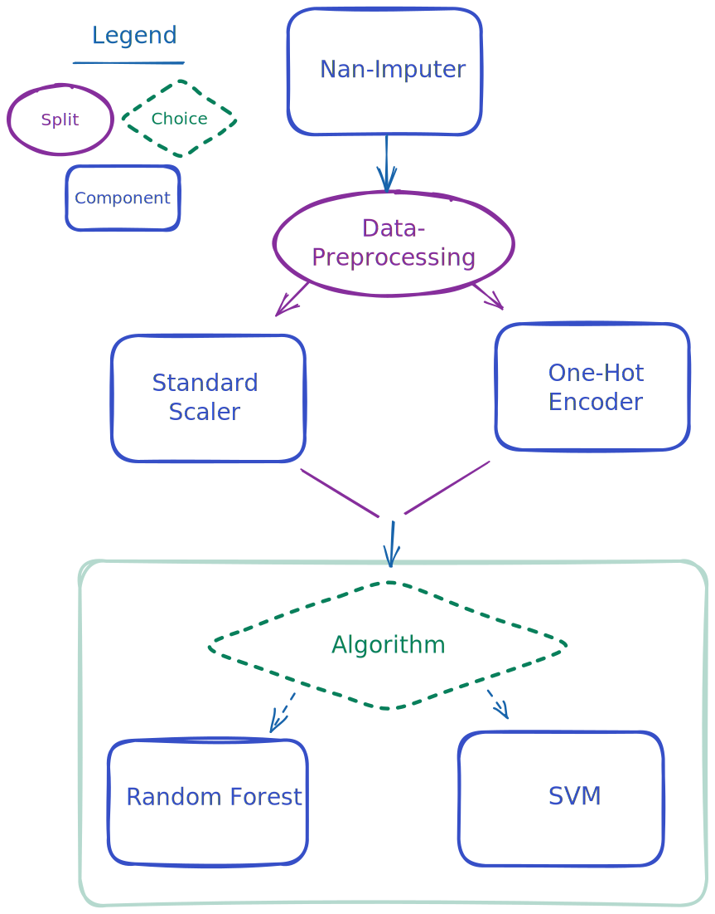
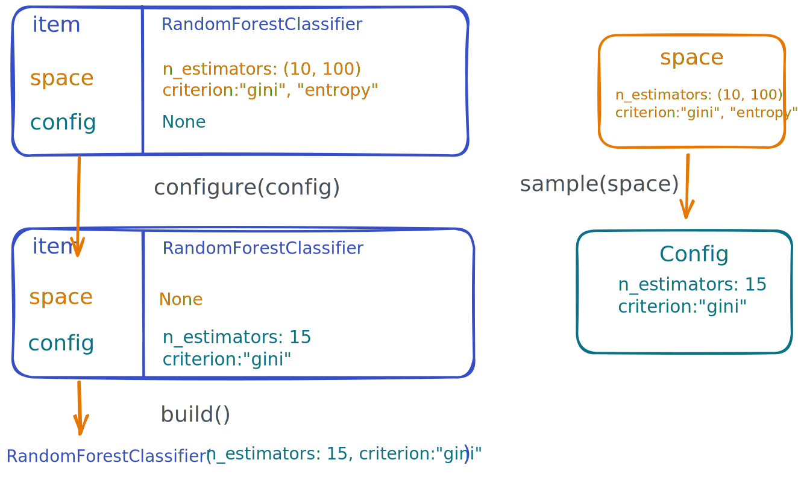
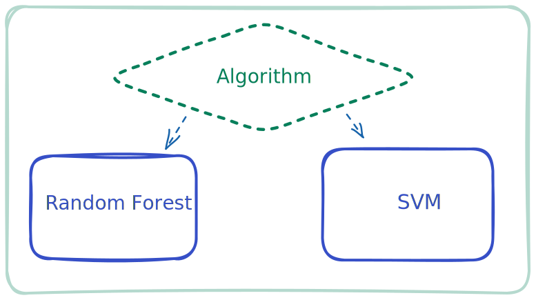
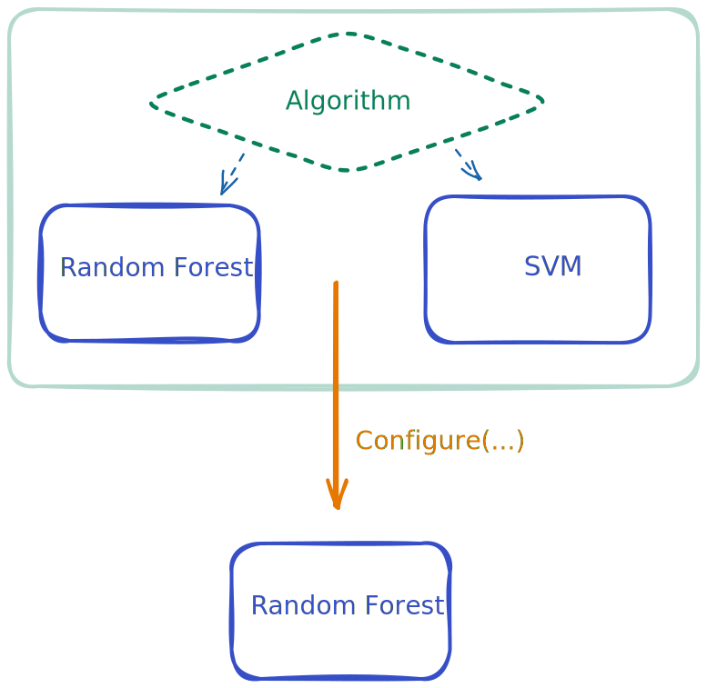
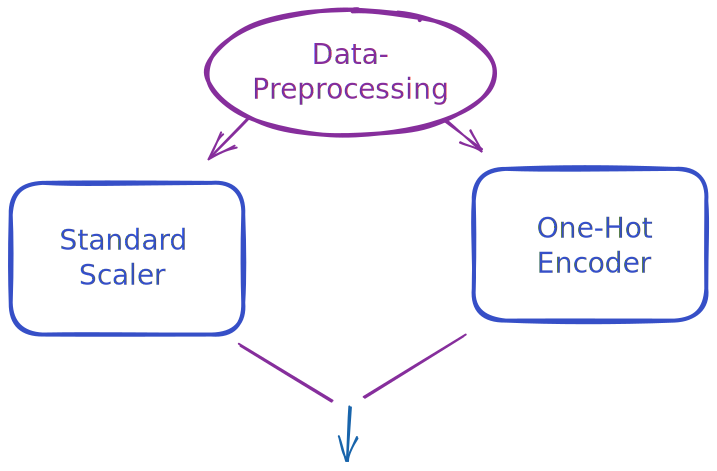

# Pipelines Guide
AutoML-toolkit was built to support future development of AutoML systems and
a central part of an AutoML system is its Pipeline. The purpose of this
guide is to help you understand all the utility AutoML-toolkit can
provide to help you define your pipeline. We will do this by introducing concepts
from the ground up, rather than top down.
Please see [examples](site:examples/index.md) if you would rather see copy-pastable examples.

---

## Introduction

At the core of a [`Pipeline`][amltk.pipeline.Pipeline] definition
is the many [`Steps`][amltk.pipeline.Step] it consists of.
By combining these together, you can define a _directed acyclic graph_ (DAG),
that repesents the flow of data through your [`Pipeline`][amltk.pipeline.Pipeline].
Here is one such example that by the end of this guide, you should be able
to construct.

=== "Image"

    

=== "Code"

    ```python
    from amltk.pipeline import Pipeline, step, split, choice

    pipeline = Pipeline.create(
        step("nan-imputer", SimpleImputer, config={"strategy": "most_frequent"}),
        split(
            "data-preprocessing",
            group(
                "categoricals",
                step(
                    "one-hot-encoder",
                    OneHotEncoder,
                    space={
                        "min_frequency": (0.01, 0.1),
                        "handle_unknown": ["ignore", "infrequent_if_exist"],
                    },
                    config={"drop": "first"},
                ),
            )
            group(
                "numericals",
                step("scaler", StandardScaler),
            )
            item=ColumnTransformer,
            config={
                "categoricals": make_column_selector(dtype_include=object),
                "numericals": make_column_selector(dtype_include=np.number),
            },
        ),
        choice(
            "algorithm",
            step("svm", SVC, space={"C": (0.1, 10.0)}, config={"probability": True}),
            step(
                "random-forest",
                RandomForestClassifier,
                space={
                    "n_estimators": [10, 100],
                    "criterion": ["gini", "entropy", "log_loss"],
                },
            ),
        ),
    )
    ```


Once we have our pipeline definition, extracting a search space, configuring
it and building it into something useful can be done with the methods,
[`pipeline.space()`][amltk.pipeline.Pipeline.space],
[`pipeline.sample()`][amltk.pipeline.Pipeline.sample],
[`pipeline.configure()`][amltk.pipeline.Pipeline.configure],
[`pipeline.build()`][amltk.pipeline.Pipeline.build],


!!! info "Building Blocks"

    There are a few concrete flavours that each encode the different parts of
    this DAG with which we can then search over.

    * [`Component`][amltk.pipeline.Component]: A step of a pipeline with an object attached
    and possibly some space attached to it.

    * [`Choice`][amltk.pipeline.Choice]: A step which represents the a choice of which step(s) is next.

    * [`Split`][amltk.pipeline.Split]: A step which represents that the data flow through a
      pipeline will be split between the following steps.
      This is usually accompanied by some object that does the data splitting.

    * [`Group`][amltk.pipeline.Group]: A grouping of steps which you can think of
      as drawing a named box around part of a pipeline. This is usually used
      to extend the names given to parameters in the search space and to help
      give extra contextual meaning. Custom pipeline builders can utilize this as they
      wish.

    * `Option`: A step which indicates the following step(s) are optionally included.

        !!! note "TODO"

            Please feel free to provide a contribution!


    There's also some _attachables_ you can
    [`attach(modules=...)`][amltk.pipeline.Pipeline.attach] to a
    [`Pipeline`][amltk.pipeline.Pipeline] for searching and configuring things that don't
    necessarily follow the DAG dataflow of a pipeline, e.g. `batch_size` for
    training Nerual Nets.

    * `modules`: For anything else which is a component, sub-pipeline, or anything else with
      an implementation and not part of the main DAG pipeline, we can still attach
      them to the main pipeline.


```python
from amltk.Pipeline imort Pipeline

pipeline = Pipeline.create(...)

# Get the space for the pipeline and sample a concrete pipeline
space = pipeline.space() # (1)!
config = pipeline.sample(space) # (2)!

# Configure the pipeline
configured_pipeline = pipeline.config(config) # (3)!

# Build the pipeline
built_pipeline = pipeline.build()  # (4)!
```

1. We can export the entire search space using [`space()`][amltk.pipeline.Pipeline.space].
  This will be any space that supports expressing your pipeline.
2. You can [`sample()`][amltk.pipeline.Pipeline.sample] from the space using the pipeline.
  This will work regardless of the implementation of the space you have.
3. Once we have a [`Config`][amltk.types.Config], we can easily _configure_ our pipeline,
  removing all the _spaces_ and replacing them with concrete a configuration.
4. Finally, with a _configured pipeline_, we can simply call
[`build()`][amltk.pipeline.Pipeline.build] on it to get a concrete object that you can use
with no `amltk` components in there.

By the end of this guide you should be able to understand each of these
components, how to create them, modify it, and build your own
[`Pipeline`][amltk.pipeline.Pipeline].

!!! Note

    This guide requires both the ConfigSpace and sklearn integrations
    to be active with `pip install sklearn configspace`
    or `pip install amltk[sklearn, configspace]`

## Components
We'll start by creating a simple `Component` for a
a [`RandomForestClassifier`][sklearn.ensemble.RandomForestClassifier],
along with its search space. We'll then
[`configure`][amltk.pipeline.Step.configure] it and
[`build()`][amltk.pipeline.Component.build] it into a standalone,
useable sklearn object, showing how you can get its
[`space()`][amltk.pipeline.Step.space]
and [`sample()`][amltk.pipeline.Step.sample]
it.




### Defining a Component

```python
from amltk.pipeline import step, Component

mystep: Component = step("hello_step", object())  # (1)!
```

1. Using keywords, `#!python step(name="hello_step", item=object())`

While this particular component isn't very useful, we can highlight two important
facts, we can associate any `object` with a step and give it a `name`, in this
case `#!python "hello_step"`.

Lets create a step that will represent a Random Forest in our pipeline and set
some parameters for it.

```python
from amltk.pipeline import step
from sklearn.ensemble import RandomForestclassifier

component = step("rf", RandomForestClassifier, config={"n_estimators": 10})
```

Here the `config` is the parameters we want to call `RandomForestClassifier`
with whenever we want to turn our pipeline definition into something concrete.

If at any point we want to convert this step into the actual `RandomForestClassifier`
object, we can always call [`build()`][amltk.pipeline.Component.build] on the step.

```python hl_lines="5"
from amltk.pipeline import step
from sklearn.ensemble import RandomForestclassifier

component = step("rf", RandomForestClassifier, config={"n_estimators": 10})
classifier = component.build()

classifier.fit(...)
classifier.predict(...)
```

This by itself as you're probably noticed is a lot of work to just build a
random forest, and you're right. However the reason to wrap everything in a step
is for what comes next.


### Defining a search space

In any machine learning pipeline, we often wish to optimize some hyperparameters
of our model. For this we actually need to define some hyperparameters. For
this example, we will be using [`ConfigSpace`](site:reference/configspace.md) and
it's syntax for defining a search space, but check out our built-in
[integrations](site:reference/index.md#search-spaces) for more.

=== "Definition"

    ```python hl_lines="6 7"
    from amltk.pipeline import step
    from sklearn.ensemble import RandomForestClassifier

    component = step(
        "rf",
        RandomForestClassifier,
        space={"n_estimators": (10, 100), "criterion": ["gini", "entropy"]},
    )
    ```

    Here we've told `amltk` that we have a component that `RandomForestClassifier`
    has two hyperparameters we care about, some integer called `#!python "n_estimators"`
    between `#!python (10, 100)` and some choice `#!python "criterion"` from
    `#!python ["gini", "entropy"]`. For the specifics of what these hyperparameters
    mean, please [refer to the scikit-learn docs][sklearn.ensemble.RandomForestClassifier].

=== "Retrievinig the space"

    ```python hl_lines="10"
    from amltk.pipeline import step
    from sklearn.ensemble import RandomForestClassifier

    component = step(
        "rf",
        RandomForestClassifier,
        space={"n_estimators": (10, 100), "criterion": ["gini", "entropy"]},
    )

    space = component.space(seed=1)
    ```

    We can retrieve a space from this component by calling [`space()`] on it.

=== "Configuring (Manual)"

    ```python hl_lines="10 11"
    from amltk.pipeline import step
    from sklearn.ensemble import RandomForestClassifier

    component = step(
        "rf",
        RandomForestClassifier,
        space={"n_estimators": (10, 100), "criterion": ["gini", "entropy"]},
    )

    config = {"n_estimators": 15, "criterion": "gini"}
    configured_component = component.configure(config)
    ```

    We can sample from this space, but first we will show how you can use
    [`configure()`][amltk.pipeline.Step.configure] with a manually written
    config to configure the component.

=== "Configuring (Sampled)"


    ```python hl_lines="10 11 13"
    from amltk.pipeline import step
    from sklearn.ensemble import RandomForestClassifier

    component = step(
        "rf",
        RandomForestClassifier,
        space={"n_estimators": (10, 100), "criterion": ["gini", "entropy"]},
    )

    space = component.space(seed=1)
    config = component.sample(space)

    configured_component = component.configure(config)
    ```

    To piece theses together, we can sample from the space and then configure
    the component with this sampled config.

=== "Building"

    ```python hl_lines="15"
    from amltk.pipeline import step
    from sklearn.ensemble import RandomForestClassifier

    component = step(
        "rf",
        RandomForestClassifier,
        space={"n_estimators": (10, 100), "criterion": ["gini", "entropy"]},
    )

    space = component.space(seed=1)
    config = component.sample(space)

    configured_component = component.configure(config)

    random_forest = configured_component.build()
    ```

    Once we have a configured component, the last step is the most simple, and that
    is we can [`build()`][amltk.pipeline.Component.build] into a useable object, i.e.
    the `RandomForestClassifier`.

??? hint "Transforming Config Values at Build Time"

    Sometimes you'll have to apply some transform to a config before it can be passed
    to the `.item`, e.g. the `RandomForestClassifier` above. This can happen when parameters
    sampled from your search space require some transofrmation based on some relevant context,
    e.g. then number of features of a given dataset.

    For example, imagine you have:

    ```python hl_lines="6 7 13" exec="true" source="material-block" result="python" title="config_transform="
    from typing import Mapping

    from amltk.pipeline import step
    from sklearn.ensemble import RandomForestClassifier

    def replace_none_strings(config: Mapping, transform_context: Any | None) -> Mapping:
        return {k: None if v == "None" else v for k, v in config.items()}

    component = step(
        "rf",
        RandomForestClassifier,
        space={"max_features": ["sqrt", "log2", "None"]}, # None as string
        config_transform=replace_none_strings,
    )

    random_config = {"max_features": "None"}
    configured_component = component.configure(random_config)

    # The transform was applied and won't error~
    rf = configured_component.build()

    print(rf)
    ```

    Suppose you have your own custom max features to choose, perhaps raising
    the number of features to some power between `0.0` and `1.0`. Here it's data-dependant
    and we need some `transform_context=` to give to the transform function

    ```python hl_lines="6 7 8 9 10 15 16 22" exec="true" source="material-block" result="python" title="Transform config with context"
    from typing import Mapping

    from amltk.pipeline import step
    from sklearn.ensemble import RandomForestClassifier

    def configure_max_features(config: Mapping, transform_context: Any | None) -> Mapping:
        new_config = dict(config)
        max_features = new_config.pop("max_features")
        new_config["max_features"] = int(transform_context["n_features"] ** max_features)
        return new_config

    component = step(
        "rf",
        RandomForestClassifier,
        space={"max_features": (0.0, 1.0)},
        config_transform=configure_max_features,
    )
    random_config = component.sample(seed=42)

    configured_component = component.configure(
        random_config,
        transform_context={"n_features": 327}
    )

    # The transform was applied and won't error~
    rf = configured_component.build()

    print(random_config)
    print(rf)
    ```


!!! info "Some other small notable features:"

    * You can also pass `#!python **kwargs` to `build()` which overwrites any
      config options set.
    * If you set a key in `config`, this will remove the parameter from the search
      space when calling `space()`.
    * We've used `RandomForestClassifier` throughout, but technically any function
      that returns an object can be used.

---

## Pipeline
Now that we know how to define a component, we can continue directly
to creating a [`Pipeline`][amltk.pipeline.Pipeline]. Afterwards, we
will introduce [`choice`][amltk.pipeline.choice] and [`split`][amltk.pipeline.split]
for creating more complex flows.


### Creating a pipeline
A `Pipeline` is simply a wrapper around a **chained** set of steps,
with convenience for constructing the entire space, configuring
it and building it, much as we did for a `Component` built with `step`.

To construct one, we will use the classmethod, [`Pipeline.create()`][amltk.pipeline.Pipeline.create],
passing in the step we have above.

=== "Embedded"

    ```python
    from amltk.pipeline import step, Pipeline
    from sklearn.ensemble import RandomForestClassifier

    pipeline = Pipeline.create(
        step(
            "rf",
            RandomForestClassifier,
            space={"n_estimators": (10, 100), "criterion": ["gini", "entropy"]},
        )
    )
    ```


=== "Seperate"

    ```python
    from amltk.pipeline import step, Pipeline
    from sklearn.svm import SVC

    component = step(
        "rf",
        SVC,
        space={"n_estimators": (10, 100), "criterion": ["gini", "entropy"]},
    )

    pipeline = Pipeline.create(component)
    ```

!!! tip "Name your pipeline"

    You can name you pipeline with the `name=` parameter, otherwise a random [`uuid4`][uuid.uuid4]
    will be provided.

    ```python
    from amltk.pipeline import Pipeline

    pipeline = Pipeline.create(..., name="my-named-pipeline")
    ```

In practice, we won't need a reference to the individual component so
we will start defining them inside the [`Pipeline.create()`][amltk.pipeline.Pipeline.create] method
itself from now on.

We can then query for the [`space()`][amltk.pipeline.Pipeline.space],
[`sample()`][amltk.pipeline.Pipeline.sample],
[`configure()`][amltk.pipeline.Pipeline.configure]
it just like we did with the single `Component`.

```python hl_lines="12 13 14"
from amltk.pipeline import step, Pipeline
from sklearn.svm import SVC

pipeline = Pipeline.create(
    step(
        "svm",
        SVC,
        space={"C": (0.1, 10.0)}
    )
)

space = pipeline.space()
config = pipeline.sample(space)
configured_pipeline = pipeline.configure(config)
```

!!! info inline end "Pipeline Implementations"

    === "Sklearn"

        If every step in the pipeline is a sklearn object, AutoML-toolkit
        will attempt to produce a [sklearn.pipeline.Pipeline][].

        !!! note "Split"

            We currently only support a [sklearn.compose.ColumnTransformer][]
            for a split.

    === "Pytorch"

        If we can detect every step in the pipeline is a [torch.nn.Module][]
        then a [torch.nn.Sequential][] will be produced for you. We do a simple
        forward from each component to the next.

        !!! info "In progress"

    === "Custom"

        If you have a custom Pipeline implementation that you expect, take
        a look at [`build(builder=...)`][amltk.pipeline.Pipeline.build] for
        how you can integrate your own.

        !!! info "Doc needs to be improved"

The difference here is when we call [`build()`][amltk.pipeline.Pipeline.build],
we no longer just get an `SVM`, as we would when calling
`build()` on the individual component, but instead
we get a usable object . AutoML-toolkit will attempt to identify
the components in your pipeline and automatically
produce a valid pipeline implementation out of it.

There are also sometimes things you want to associate and search
alongside with your pipeline but are not necessarily part of
the DAG structure of `Pipeline`. For this reason we also
provide [`modules`](#modules), which
will be part of the space returned by `space()` and configured
by `configure()` for you.

### Extending the pipeline
Of course a single step is not a real pipeline, and so we now
move onto chaining together steps that will be part of the pipeline.
For this section, we will focus on an `SVM` with a
[StandardScaler][sklearn.preprocessing.StandardScaler] on the input.

=== "The `|` (pipe) operator"

    !!! info inline end

        To join together two steps, we introduce the handy pipe operator `|`,
        inspired by the pipe operator from shell scripting.
        This will return the first step in the chain but with anything after
        that attached to it.

    ```python hl_lines="6"
    from amltk import step

    standard_scalaer = step("standard", StandardScaler)
    svm = step("svm", SVC, space={"C": (0.1, 10.0)})

    head = standard_scaler | svm
    ```


=== "Joining two steps"

    !!! info inline end

        Using this `|` operator, we can tell our pipeline defintion that
        one step follows another. On the highlighted line, you
        can see it in action.

    ```python hl_lines="11"
    from amltk.pipeline import Pipeline
    from sklearn.svm import SVC
    from sklearn.impute import SimpleImputer

    pipeline = Pipeline.create(
        step(
            "impute"
            SimpleImputer,
            space={"strategy": ["most_frequent", "mean"]},
        )
        | step(
            "svm",
            SVC,
            space={"C": (0.1, 10.0)}
        )
    )
    ```


=== "More steps"

    !!! info inline end

        Using the `|` operator, we can easily begin to extend and modify
        our pipeline defintion.

    ```python hl_lines="12"
    from amltk.pipeline import Pipeline
    from sklearn.svm import SVC
    from sklearn.preprocessing import StandarScaler
    from sklearn.impute import SimpleImputer

    pipeline = Pipeline.create(
        step(
            "impute"
            SimpleImputer,
            space={"strategy": ["most_frequent", "mean"]},
        )
        | step("scaler", StandardScaler),
        | step(
            "svm",
            SVC,
            space={"C": (0.1, 10.0)}
        )
    )
    ```


=== "Build"

    !!! info inline end

        The `space`, `config` and final pipeline implementation exported
        with `build` include all the steps in the pipeline. In this case,
        as all our components are from `sklearn`, we end up up with
        a valid [sklearn.pipeline.Pipeline][].

    ```python hl_lines="22 23 24"
    from amltk.pipeline import Pipeline
    from sklearn.svm import SVC
    from sklearn.preprocessing import StandarScaler
    from sklearn.impute import SimpleImputer

    pipeline = Pipeline.create(
        step(
            "impute"
            SimpleImputer,
            space={
                "strategy": ["most_frequent", "mean"],
            },
        )
        | step("scaler", StandardScaler),
        | step(
            "svm",
            SVC,
            space={"C": (0.1, 10.0)}
        )
    )

    space = pipeline.space()
    config = pipeline.sample(space)
    sklearn_pipeline = pipeline.configure(config).build()
    ```


---

!!! note "Next steps"

    This marks the end for the basics of [`Pipeline`][amltk.pipeline.Pipeline]
    but is by no means a complete introduction. We
    recommend checking out the following sections to learn more:

    * [Choices](#choices) to create heirarchical definitions with choices.
    * [Splits](#splits) to define components that split data into two parallel
      subpipelines.
    * [Modules](#modules) to define components that are required for the pipeline
      usage but not necassarily part of its DAG structure, e.g. a trainer
      for a neural network.
    * [Subpipelines](#sub-pipelines) to build a pipeline in a more flexible manner.
    * [Operations](#operations) supported by the pipeline for inspection
      and modification of existing pipelines.


## Choices
Assuming we know how to create a `Component` using [`step()`][amltk.pipeline.api.step],
we will look at the how to define choices. It's worth noting
that choices are only possible with search spaces that support
it. Check out our [integrated search spaces](site:reference/index.md#search-spaces)
to find out which implementations do.

Lets start by first defining a choice between two algorithms,
a `RandomForestClassifier` and an `SVC`.



First thing we should do is define our two steps.

```python
from amltk.pipeline import step
from sklearn.ensemble import RandomForestClassfier
from sklearn.svm import SVC

rf = step("rf", RandomForestClassifier, space={"n_estimators": (10, 100)})
svm = step("svm", SVC, space={"C": (0.1, 10.0)})
```

To combine these two into a choice, we wrap the two steps in a [`Choice`][amltk.pipeline.Choice]
as created by [`choice(...)`][amltk.pipeline.choice]. Notice below there
is no `|` operator, as we do not wish to chain these together.

```python hl_lines="5 6 7 8"
from amltk.pipeline import step, choice
from sklearn.ensemble import RandomForestClassfier
from sklearn.svm import SVC

classifier_choice = choice(
    "algorithm",
    step("rf", RandomForestClassifier, space={"n_estimators": (10, 100)}),
    step("svm", SVC, space={"C": (0.1, 10.0)})
)
```

To illustrate what the config looks like and what configuring does,
we can create our own manual config.

```python
from amltk.pipeline import step, choice
from sklearn.ensemble import RandomForestClassfier
from sklearn.svm import SVC

classifier_choice = choice(
    "algorithm",
    step("rf", RandomForestClassifier, space={"n_estimators": (10, 100)}),
    step("svm", SVC, space={"C": (0.1, 10.0)})
)

config = {"algorithm": "svm", "algorithm:svm:C": 0.3}  # (1)!
configured_choice = classifier_choice.configure(config)

classifier = configured_choice.build()
```

1. Notice that `#!python "algorithm"` is used as a prefix as both `#!python "rf"`
and `#!python "svm"` are under the heirarchy of the choice.

!!! Note

    By calling [`configure()`][amltk.pipeline.Group.configure] on a `Choice` with
    a valid configuration, you collapse the choice down to a single valid `Component`.



Lastly, you can still access the
[`space()`][amltk.pipeline.Step.space],
[`sample()`][amltk.pipeline.Step.sample],
[`configure()`][amltk.pipeline.Group.configure],
[`build()`][amltk.pipeline.Split.build],
methods of a `Choice` in much the same way as mentioned for a `Component`.

Some extra things to know about a [`Choice`][amltk.pipeline.Choice] made
from [`choice()`][amltk.pipeline.choice].
* You can pass weights to `choice(..., weights=...)`, where the `weights` are
  the same length and same order as the steps in the choice. These weights
  will be encoded into the [search space if possible](site:reference/#search-spaces).
* There is no (sane) limit to the number of choices you can have.

## Splits
A `Split` is how we define that data should flow through different subpaths
of our `Pipeline`.



How this is done is very specific to a component and so
we will use a [sklearn.compose.ColumnTransformer][] as the item for this example.
In practice, you can define your own object that splits the data for the pipeline
implementation you are interested in.

=== "The `#!python "categorical"` path"

    ```python
    from sklearn.impute import SimpleImputer
    from sklearn.preprocessing import OneHotEncoder

    from amltk.pipeline import split

    categorical = group(
        "categorical",
        step(
            "categorical_imputer",
            SimpleImputer,
            space={"strategy": ["most_frequent", "constant"]}
            config={"fill_value": "missing"}
        )
        | step(
            "one-hot-encoder"
            OneHotEncoder,
            space={"min_frequency": (0.01, 0.1), max_categories: (1, 10) },
            config={"drop": "first", "handle_unknown": "infrequent_if_exist"},
        ),
    )
    ```

    We start by defining how are categoricals should be treated, which uses a
    [sklearn.impute.SimpleImputer][] to impute missing values, followed by
    a [sklearn.preprocessing.OneHotEncoder][] to encode the varialbes numerically.

=== "The `#!python "numerical"` path"

    ```python
    from sklearn.impute import SimpleImputer
    from sklearn.preprocessing import FunctionTransformer, MinMaxScaler, RobustScaler, StandardScaler

    from amltk.pipeline import split

    numerical = group(
        "numerical",
        step("numerical_imputer", SimpleImputer, space={"strategy": ["mean", "median"]}),
        | choice(
            "scaler",
            step("standard", StandardScaler),
            step("minmax", MinMaxScaler),
            step("robust", RobustScaler),
            step("passthrough", FunctionTransformer),
        )
    )
    ```

    Next we will define the numerical part of the preprocessing pipeline,
    again using a [`SimplerImputer`][sklearn.impute.SimpleImputer], followed
    by a choice of scalers from sklearn.


=== "Creating the `Split`"

    ```python hl_lines="36 37 38 39 40 41 42 43 44 45 46"
    from sklearn.impute import SimpleImputer
    from sklearn.preprocessing import FunctionTransformer, MinMaxScaler, RobustScaler, StandardScaler, OneHotEncoder
    from sklearn.compose import ColumnTransformer, make_column_selector
    import numpy as np

    from amltk.pipeline import step, split, Pipeline

    numerical = group(
        "numerical",
        step("numerical_imputer", SimpleImputer, space={"strategy": ["mean", "median"]}),
        | choice(
            "scaler",
            step("standard", StandardScaler),
            step("minmax", MinMaxScaler),
            step("robust", RobustScaler),
            step("passthrough", FunctionTransformer),
        )
    )

    categorical = group(
        "categorical",
        step(
            "categorical_imputer",
            SimpleImputer,
            space={"strategy": ["most_frequent", "constant"]}
            config={"fill_value": "missing"}
        )
        | step(
            "one-hot-encoder"
            OneHotEncoder,
            space={"min_frequency": (0.01, 0.1), max_categories: (1, 10) },
            config={"drop": "first", "handle_unknown": "infrequent_if_exist"},
        ),
    )

    pipeline = Pipeline.create(
        split(
            "data_preprocessing",
            categorical,
            numerical,
            item=ColumnTransformer,
            config={
                "categorical": make_column_selector(dtype_include=object),  # (1)!
                "numerical": make_column_selector(dtype_include=np.number),  # (2)!
                "remainder": "passthrough",  # (3)!
            }
    )
    ```

    1. The [`make_column_selector`][sklearn.compose.make_column_selector] is how we select
       columns from our data which are of `#!python dtype=object`. Notice
       that we match `#!python "categorical"` to the group name in the
       path for handling categorical features. This is an artifact of
       how we build the [sklearn.pipeline.Pipeline][].
    2. Much the same as the line above except we select all numerical
       columns and send them to the `#!python "numerical"` path in the
       split.
    3. This is how you implement a `"passthrough"` in an sklearn
       Pipeline, such that no transformation is applied to the "#!python remainder".

    Notice above that we grouped each path, giving them a unique name to match to,
    namely `#!python "categorical"` and `#!python "numerical"` which matches to
    `#!python split(config={"numerical": ..., "categorical": ...})`.
    This is how a [sklearn.compose.ColumnTransformer][] is built and nothing special that we do.

=== "All in One"

    ```python
    from sklearn.impute import SimpleImputer
    from sklearn.preprocessing import FunctionTransformer, MinMaxScaler, RobustScaler, StandardScaler, OneHotEncoder
    from sklearn.compose import ColumnTransformer, make_column_selector
    import numpy as np

    from amltk.pipeline import step, split, Pipeline

    pipeline = Pipeline.create(
        split(
            "data_preprocessing",
            group(
                "categorical",
                step(
                    "categorical_imputer",
                    SimpleImputer,
                    space={"strategy": ["most_frequent", "constant"]}
                    config={"fill_value": "missing"}
                )
                | step(
                    "one-hot-encoder"
                    OneHotEncoder,
                    space={"min_frequency": (0.01, 0.1), max_categories: (1, 10) },
                    config={"drop": "first", "handle_unknown": "infrequent_if_exist"},
                ),
            ),
            group(
                "numerical",
                step("numerical_imputer", SimpleImputer, space={"strategy": ["mean", "median"]}),
                | choice(
                    "scaler",
                    step("standard", StandardScaler),
                    step("minmax", MinMaxScaler),
                    step("passthrough", FunctionTransformer),
                )
            )
            item=ColumnTransformer,
            config={
                "categorical": make_column_selector(dtype_include=object),
                "numerical": make_column_selector(dtype_include=np.number),
            }
    )
    ```

## Modules
A pipeline is often not sufficient to represent everything surrounding the pipeline
that you'd wish to associate with it. For that reason we introduce the concept
of _module_.
These are components or pipelines that you [`attach()`][amltk.pipeline.Pipeline.attach]
to your main pipeline, but are not directly part of the dataflow.

For example, we can create a simple `searchable` which we `attach()` to our pipeline.
This will be included in the `space()` that it outputed from the `Pipeline` and also
configured when `configure()` is called.

```python
from amltk.pipeline import Pipeline, searchable

pipeline = Pipeline.create(...)
pipeline = pipeline.attach( # (1)!
    modules=[
        searchable("extra_params", space={"a": (1, 10), "b": ["apple", "frog"]}),
        searchable("other_params", space={"c": (1.5, 1.8)}),
    ]
)

space = pipeline.space()
config = pipeline.sample(space)

pipeline = pipeline.configure(config)
pipeline.modules["extra_params"].config["a"]  # (2)!
```

1. Note here we need to assign the result of `attach`. In general,
operations on a `Pipeline` are not in-place and return a copy with
the modification.
2. You can access it's set value from the `.modules` attrbitue of the pipeline.

Lets take PyTorchLightning's trainers for example, they define how you network should
be trained but not actually how data should flow.

Lets see how we might [`attach()`][amltk.pipeline.Pipeline.attach] this to a `Pipeline`.

```python hl_lines="8"
from amltk.pipeline import Pipeline, step
from lightning.pytorch import Trainer

pipeline = Pipeline.create(...)

trainer_module = step("trainer", Trainer)

pipeline = pipeline.attach(modules=trainer_module)  # (1)!
```

1. Note here we need to assign the result of `attach`. In general,
operations on a `Pipeline` are not in-place and return a copy with
the modification.

We can then easily access and build this as required.

```python
from amltk.pipeline import Pipeline, step
from lightning.pytorch import Trainer

pipeline = Pipeline.create(...)

trainer_module = step("trainer", Trainer)

pipeline = pipeline.attach(modules=trainer_module)

# ... later in the code

trainer = pipeline["trainer"].build()
model = pipeline.build()

# ... use
```

Now this is not very useful by itself, but we can also define a `space` which
is conveniently present in the `pipeline`'s space. This also means that
we also configure any modules when caliing `pipline.configure()`. Lastly,
we can access the module using the `.modules` attribute with
`#!python pipeline.modules["trainer"]` to call `build()` on it.

```python
from amltk.pipeline import Pipeline, step

pipeline = Pipeline.create(...)

trainer_module = step("trainer", Trainer, space={"precision": [16, 32, 64]})

pipeline.attach(modules=trainer_module)

space = pipeline.space()  # (1)!

config = pipeline.sample(space)

configured_pipeline = pipeline.configure(config)  # (2)!

model = pipeline.build()
trainer = pipeline.modules["trainer"].build()  # (3)!
```

1. The space includes a hyperparameter `#!python "trainer:precision"` such that
 any sampling or searching of the space also includes the attached modules.
2. When we `configure()` the pipeline, this also configures all modules attached
 to the pipeline.
3. As the module `#!python "trainer"` was configured along with the pipeline,
 it's `config` has been set and we can call `build()` on it.

## Seeding and `request`s
You may have scenarios where you need to configure your pipeline with something that
isn't necessarily something you want to search but is not known until you actually
want to configure your pipeline. One prominent example is seeding. We can achieve
this by using [`request()`][amltk.pipeline.request].

```python hl_lines="10" exec="true" source="material-block" result="python" title="request()"
from amltk.pipeline import step, request
from sklearn.ensemble import RandomForestClassifier

component = step(
    "rf",
    RandomForestClassifier,
    space={
        "n_estimators": (10, 100),
        "criterion": ["gini", "entropy"],
    },
    config={
        "random_state": request("seed", default=None)
    }
)

config = {"rf:n_estimators": 15, "rf:criterion": "gini"}
component.configure(config, params={"seed": 42})

print(component.config)
```

!!! tip

    If you specifically require it to be set, you can use `request(..., required=True)`.

## Operations
TODO
