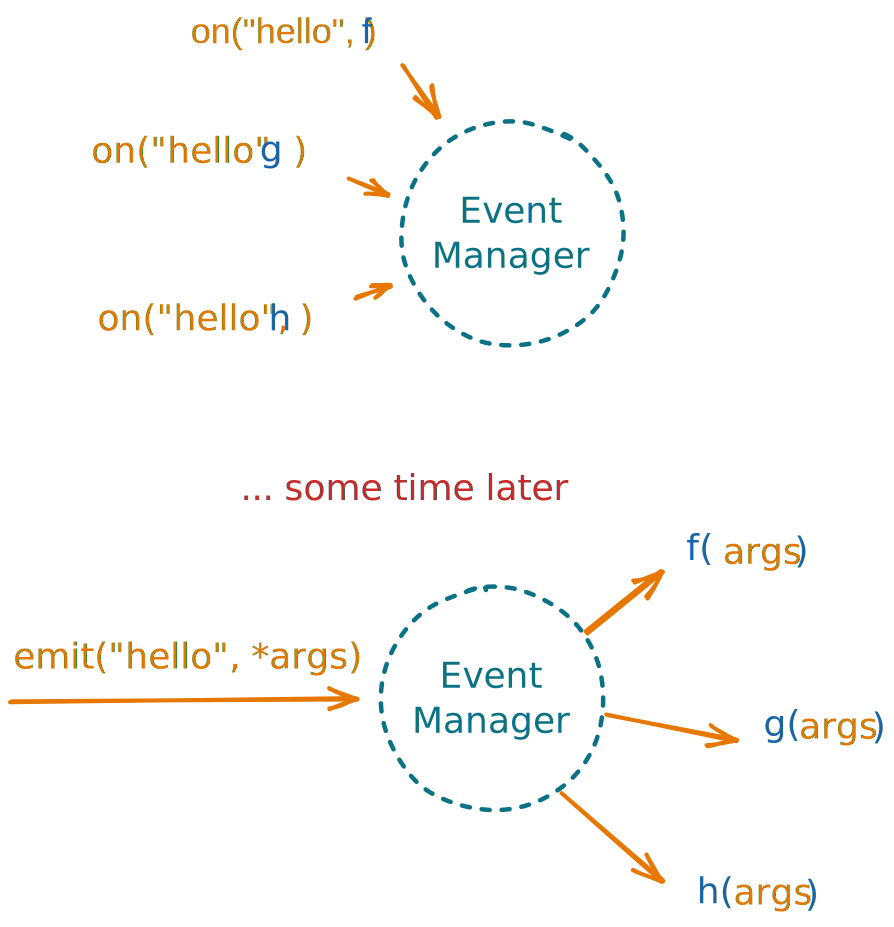
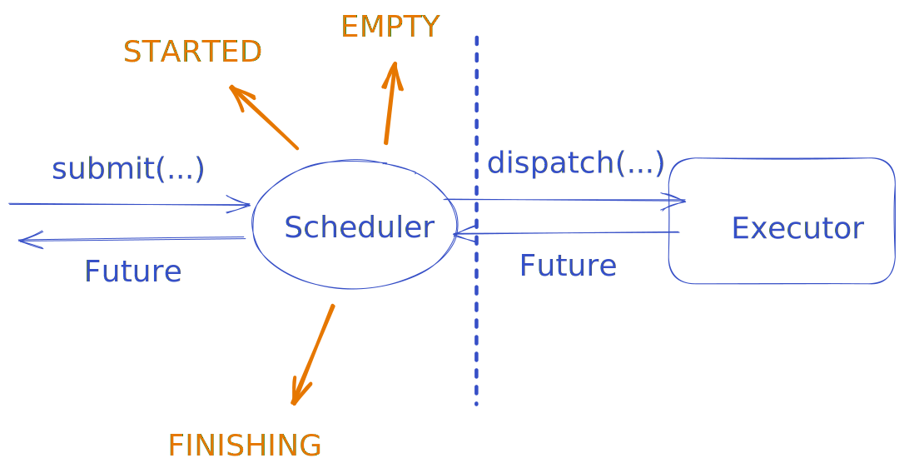

AutoML-toolkit was designed to make offloading computation
away from the main process __easy__, to foster increased ability for
interactability, deployment and control. At the same time,
we wanted to have an event based system to manage the complexity
that comes with AutoML systems, all while making the API intuitive
and extensible. This allows workflows which encourage gradual development
and experimentation, where the user can incrementally add more functionality
and complexity to their system.

By the end of this guide, we hope that the following code, its options
and its inner working become easy to understand.

```python
from amltk.scheduling import Scheduler, Task

def the_anwser(a: int, b: int, c: int) -> int:
    the_answer = ...
    return the_answer

scheduler = Scheduler(executor=...)
task = Task(compute_42, scheduler, ...)

@scheduler.on_start
def start_computing() -> None:
    task(1, 2, 3)

@task.on_returned
def print_answer_found(the_answer: int) -> None:
    print(f"{the_answer} was found!")

@task.on_exception
def print_exception(exception: BaseException) -> None:
    print(f"Finding the answer failed: {exception}")

scheduler.run()
```


This guide starts with a simple introduction to `amltk`'s event system, which
acts as the gears through which the whole system moves.
After that, we introduce the engine, the [`Scheduler`][amltk.scheduling.Scheduler]
and how this interacts with python's built-in interface [`Executor`][concurrent.futures.Executor]
to offload compute to processes, compute nodes or even cloud resources.
However, the `Scheduler` is rather useless without some fuel.
For this, we present [`Tasks`][amltk.scheduling.Task], the computational task to
perform with the `Scheduler` and start the system's gears turning.

## Events
At the core of AutoML-Toolkit is an [`EventManager`][amltk.events.EventManager]
whose sole purpose is to allow you to do two things:

* [`emit`][amltk.events.EventManager.emit]: Emit some event with arguments.
* [`on`][amltk.events.EventManager.on]: Register a function which gets called when a certain
  event is emitted.

=== "Diagram"

    

=== "Code"


    ```python
    from amltk.events import EventManager

    def f(a: int, b: str, c: float) -> None:
        ...

    def g(a: int, b: str, c: float) -> None:
        ...

    def h(a: int, b: str, c: float) -> None:
        ...

    event_manager = EventManager(name="manager-name")

    # Subscribe the callbacks to the "hello" event
    event_manager.on("hello", f)
    event_manager.on("hello", g)
    event_manager.on("hello", h)

    # ... some time later

    # Will call all functions subscribed to the hello event
    event = "hello"
    event_manager.emit(event, 10, "world", 3.14)
    ```

We can technically define any [`Hashable`][typing.Hashable] object as an event, such as `#!python "hello"`,
but typically we create an [`Event`][amltk.events.Event] object. By themselves they don't add much
but when using python's
typing and mypy/pyright, this let's us make sure the callbacks
registered to an event are compatible with the arguments passed to
[`emit`][amltk.events.EventManager.emit].

=== "Creating an Event"

    ```python hl_lines="11"
    from amltk.events import EventManager, Event

    def f(a: int, b: str, c: float) -> None:
        ...

    def h(x: str) -> None:
        ...

    event_manager = EventManager(name="manager-name")

    event = Event(name="hello")

    # Subscribe the callbacks to the "hello" event
    event_manager.on(event, f)
    event_manager.on(event, h)  # <--- This is not compatible with the emit below

    # ... some time later
    event_manager.emit(event, 10, "world", 3.14)  # <--- Exception happens when `h` is called
    ```

=== "Typed version"

    ```python hl_lines="11"
    from amltk.events import EventManager, Event

    def f(a: int, b: str, c: float) -> None:
        ...

    def h(x: str) -> None:
        ...

    event_manager = EventManager(name="manager-name")

    event: Event[int, str, float] = Event(name="hello")

    # Subscribe the callbacks to the "hello" event
    event_manager.on(event, f)
    event_manager.on(event, h)  # <--- Mypy will tell you there's an error here

    # ... some time later
    event_manager.emit(event, 10, "world", 3.14)
    ```

There is some _sugar_ the `EventManager` provides but we will introduce
them as we go along.

## Scheduler
The engine of AutoML-Toolkit is the [`Scheduler`][amltk.scheduling.Scheduler].
It requires one thing to function and that's an
[`Executor`][concurrent.futures.Executor], an interface defined
by core python for something that takes a function `f` and
it's arguments, returning a [`Future`][concurrent.futures.Future].



!!! quote "A [`Future`][concurrent.futures.Future]"

    This is a builtin Python object which will have the result or exception of some
    compute in the future.

Using just these, we can start to scaffold an entire event based framework which
starts from the `Scheduler` and builds outwards to the cleaner abstraction, a [`Task`][amltk.scheduling.Task].

### Creating a Scheduler

Some popular distributions frameworks which support the `Executor` interface
or we provide an integration for.

If there's an executor background you wish to integrate, we would be happy
to consider it and greatly appreciate a PR!

####  :material-language-python: **Python**
---

Python supports the `Executor` interface natively with the
[`concurrent.futures`][concurrent.futures] module for processes with the
[`ProcessPoolExecutor`][concurrent.futures.ProcessPoolExecutor] and
[`ThreadPoolExecutor`][concurrent.futures.ThreadPoolExecutor] for threads.

??? example

    === "Process Pool Executor"

        ```python
        from amltk.scheduling import Scheduler

        scheduler = Scheduler.with_processes(2)  # (1)!
        ```

        1. Explicitly use the `with_processes` method to create a `Scheduler` with
           a `ProcessPoolExecutor` with 2 workers.
           ```python
            from concurrent.futures import ProcessPoolExecutor
            from amltk.scheduling import Scheduler

            executor = ProcessPoolExecutor(max_workers=2)
            scheduler = Scheduler(executor=executor)
           ```

    === "Thread Pool Executor"

        ```python
        from amltk.scheduling import Scheduler

        scheduler = Scheduler.with_threads(2)  # (1)!
        ```

        1. Explicitly use the `with_threads` method to create a `Scheduler` with
           a `ThreadPoolExecutor` with 2 workers.
           ```python
            from concurrent.futures import ThreadPoolExecutor
            from amltk.scheduling import Scheduler

            executor = ThreadPoolExecutor(max_workers=2)
            scheduler = Scheduler(executor=executor)
           ```

        !!! danger "Why to not use threads"

            Python also defines a [`ThreadPoolExecutor`][concurrent.futures.ThreadPoolExecutor]
            but there are some known drawbacks to offloading heavy compute to threads. Notably,
            there's no way in python to terminate a thread from the outside while it's running.

#### :simple-dask: [`dask`](https://distributed.dask.org/en/stable/)
---

Dask and the supporting extension [`dask.distributed`](https://distributed.dask.org/en/stable/)
provide a robust and flexible framework for scheduling compute across workers.

??? example

    ```python hl_lines="5"
    from dask.distributed import Client
    from amltk.scheduling import Scheduler

    client = Client(...)
    executor = client.get_executor()
    scheduler = Scheduler(executor=executor)
    ```

#### :simple-dask: [`dask-jobqueue`](https://jobqueue.dask.org/en/latest/)
---

A package for scheduling jobs across common clusters setups such as
PBS, Slurm, MOAB, SGE, LSF, and HTCondor.


??? example

    Please see the `dask-jobqueue` [documentation](https://jobqueue.dask.org/en/latest/)
    In particular, we only control the parameter `#!python n_workers=` to
    use the [`adapt()`](https://jobqueue.dask.org/en/latest/index.html?highlight=adapt#adaptivity)
    method, every other keyword is forwarded to the relative
    [cluster implementation](https://jobqueue.dask.org/en/latest/api.html).

    In general, you should specify the requirements of each individual worker and
    and tune your load with the `#!python n_workers=` parameter.

    If you have any tips, tricks, working setups, gotchas, please feel free
    to leave a PR or simply an issue!

    === "Slurm"

        ```python hl_lines="3 4 5 6 7 8 9"
        from amltk.scheduling import Scheduler

        scheduler = Scheduler.with_slurm(
            n_workers=10,  # (1)!
            queue=...,
            cores=4,
            memory="6 GB",
            walltime="00:10:00"
        )
        ```

        1. The `n_workers` parameter is used to set the number of workers
           to start with.
           The [`adapt()`](https://jobqueue.dask.org/en/latest/index.html?highlight=adapt#adaptivity)
           method will be called on the cluster to dynamically scale up to `#!python n_workers=` based on
           the load.
           The `with_slurm` method will create a [`SLURMCluster`][dask_jobqueue.SLURMCluster]
           and pass it to the `Scheduler` constructor.
           ```python hl_lines="10"
           from dask_jobqueue import SLURMCluster
           from amltk.scheduling import Scheduler

           cluster = SLURMCluster(
               queue=...,
               cores=4,
               memory="6 GB",
               walltime="00:10:00"
           )
           cluster.adapt(max_workers=10)
           executor = cluster.get_client().get_executor()
           scheduler = Scheduler(executor=executor)
           ```

        !!! warning "Running outside the login node"

            If you're running the scheduler itself in a job, this will
            not work. The scheduler itself is lightweight and can run on the
            login node without issue. However you should make sure to offload
            heavy computations to a worker.

            If you get it to work, for example in an interactive job, please
            let us know!

        !!! info "Modifying the launch command"

            On some cluster commands, you'll need to modify the launch command.
            You can use the following to do so:

            ```python
            from amltk.scheduling import Scheduler

            scheduler = Scheduler.with_slurm(n_workers=..., submit_command="sbatch --extra"
            ```

    === "Others"

        Please see the `dask-jobqueue` [documentation](https://jobqueue.dask.org/en/latest/)
        and the following methods:

        * [`Scheduler.with_pbs()`][amltk.scheduling.Scheduler.with_pbs]
        * [`Scheduler.with_lsf()`][amltk.scheduling.Scheduler.with_lsf]
        * [`Scheduler.with_moab()`][amltk.scheduling.Scheduler.with_moab]
        * [`Scheduler.with_sge()`][amltk.scheduling.Scheduler.with_sge]
        * [`Scheduler.with_htcondor()`][amltk.scheduling.Scheduler.with_htcondor]

#### :simple-ray: [`ray`](https://docs.ray.io/en/master/)
---

Ray is an open-source unified compute framework that makes it easy
to scale AI and Python workloads
— from reinforcement learning to deep learning to tuning,
and model serving.

??? info "In progress"

    Ray is currently in the works of supporting the Python
    `Executor` interface. See this [PR](https://github.com/ray-project/ray/pull/30826)
    for more info.

#### :simple-apacheairflow: [`airflow`](https://airflow.apache.org/)
---

Airflow is a platform created by the community to programmatically author,
schedule and monitor workflows. Their list of integrations to platforms is endless
but features compute platforms such as Kubernetes, AWS, Microsoft Azure and
GCP.

??? info "Planned"

    We plan to support `airflow` in the future. If you'd like to help
    out, please reach out to us!

---

#### :material-debug-step-over: Debugging

Sometimes you'll need to debug what's going on and remove the noise
of processes and parallelism. For this, we have implemented a very basic
[`SequentialExecutor`][amltk.scheduling.SequentialExecutor] to run everything
in a sequential manner!

=== "Easy"

    ```python
    from amltk.scheduling import Scheduler

    scheduler = Scheduler.with_sequential()
    ```

=== "Explicit"

    ```python
    from amltk.scheduling import Scheduler, SequetialExecutor

    scheduler = Scheduler(executor=SequentialExecutor())
    ```

!!! warning "Recursion"

    If you use The `SequentialExecutor`, be careful that the stack
    of function calls can get quite large, quite quick. If you are
    using this for debugging, keep the number of submitted tasks
    from callbacks small and focus in on debugging. If using this
    for sequential ordering of operations, prefer to use
    `with_processes(1)` as this will still maintain order but not
    have these stack issues.


### Subscribing to Scheduler Events

The `Scheduler` defines many events which are emitted depending on its state.
One example of this is `STARTED`, an event to signal the scheduler has started and ready to
accept tasks. We can subscribe to this event and trigger our callback with
[`.on_start()`][amltk.scheduling.Scheduler.on_start].

!!! info inline end "Events"

    The `Scheduler` defines even more events which we can subscribe to:

    ---
    `STARTED` : [`.on_start()`][amltk.scheduling.Scheduler.on_start].

    An event to signal that the scheduler is now up and running.

    ---

    `FINISHING` : [`on_finishing()`][amltk.scheduling.Scheduler.on_finishing]

    An event to signal the scheduler is still running but is waiting for
    currently running tasks to finish.

    ---

    `FINISHED` : [`on_finished()`][amltk.scheduling.Scheduler.on_finished]

    An event to signal the scheduler is no longer running and this is
    the last event it will emit.

    ---

    `EMPTY` : [`on_empty()`][amltk.scheduling.Scheduler.on_empty]

    An event to signal that there is nothing currently running in the scheduler.

    ---

    `TIMEOUT` : [`on_timeout()`][amltk.scheduling.Scheduler.on_timeout]

    An event to signal the scheduler has reached its time limit.

    ---

    `STOP` : [`on_stop()`][amltk.scheduling.Scheduler.on_stop]

    An event to signal the scheduler has been stopped explicitly with
    [`scheduler.stop()`][amltk.scheduling.Scheduler.stop].

    ---

    `FUTURE_SUBMITTED`: [`on_future_submitted()`][amltk.scheduling.Scheduler.on_future_submitted].

    An event to signal a future has been submitted to the scheduler.

    ---

    `FUTURE_DONE`: [`on_future_done()`][amltk.scheduling.Scheduler.on_future_done].

    An event to signal a future is done, having a result or an exception.

    ---

    `FUTURE_CANCELLED`: [`on_future_cancelled()`][amltk.scheduling.Scheduler.on_future_cancelled].

    An event to signal that a future has been cancelled.

    ---


We provide two ways to do so, one with _decorators_ and another in a _functional_
way.

=== "Decorators"

    ```python
    from amltk.scheduling import Scheduler

    scheduler = Scheduler(...)

    @scheduler.on_start  # (1)!
    def print_hello() -> None:
        print("hello")
    ```

    1. You can decorate your callback and it will be called when the
    scheduler emits the `STARTED` event.

=== "Functional"

    ```python
    from amltk.scheduling import Scheduler

    scheduler = Scheduler(...)

    def print_hello() -> None:
        print("hello")

    scheduler.on_start(print_hello)  # (1)!
    ```

    1. You can just pass in your callback and it will be called when the
    scheduler emits the `STARTED` event.

There's a variety of parameters you can use to customize the behavior of
the callback. You can find the full list of parameters [here][amltk.events.Subscriber.__call__].

=== "`name=`"

    Register a custom name with the callback to use for logging
    or to [`remove`][amltk.events.Subscriber.remove] the callback later.

    ```python hl_lines="5"
    from amltk.scheduling import Scheduler

    scheduler = Scheduler(...)

    @scheduler.on_start(name="my_callback")
    def print_hello() -> None:
        print("hello")
    ```

=== "`when=`"

    A callable which takes no arguments and returns a `bool`. The callback
    will only be called when the `when` callable returns `True`.

    ```python hl_lines="10"
    import random
    from amltk.scheduling import Scheduler

    scheduler = Scheduler(...)

    def random_bool() -> bool:
        return random.choice([True, False])

    # Randomly decide whether to call the callback
    @scheduler.on_start(when=random_bool)
    def print_hello() -> None:
        print("hello")
    ```
=== "`limit=`"

    Limit the number of times a callback can be called, after which, the callback
    will be ignored.

    ```python hl_lines="6"
    from amltk.scheduling import Scheduler

    scheduler = Scheduler(...)

    # Make sure it can only be called once
    @scheduler.on_start(limit=1)
    def print_hello() -> None:
        print("hello")
    ```

=== "`repeat=`"

    Repeat the callback a certain number of times, every time the event is emitted.

    ```python hl_lines="6"
    from amltk.scheduling import Scheduler

    scheduler = Scheduler(...)

    # Print "hello" 3 times when the scheduler starts
    @scheduler.on_start(repeat=3)
    def print_hello() -> None:
        print("hello")
    ```

=== "`every=`"

    Only call the callback every `every` times the event is emitted. This
    includes the first time it's called.

    ```python hl_lines="6"
    from amltk.scheduling import Scheduler

    scheduler = Scheduler(...)

    # Print "hello" only every 3 times the scheduler starts.
    @scheduler.on_start(every=3)
    def print_hello() -> None:
        print("hello")
    ```

It's worth noting that even though we are using an event based system, we
are still guaranteed deterministic execution of the callbacks for any given
event. The source of indeterminism is the order in which the events are
emitted, as discussed later in the [tasks section](#tasks).

We can access all the counts of all events through the
[`scheduler.event_counts`][amltk.events.Emitter.event_counts] property.
This is a `dict` which has the events as keys and the amount of times
it was emitted as the values.

??? info "Unnecessary Details"

    While not necessary to know, `on_start` is actually a callable object
    called a [`Subscriber`][amltk.events.Subscriber].

    You can create one of these quite easily!

    ```python hl_lines="3 6"
    from amltk.events import EventManager, Event

    USER_JOINED: Event[str] = Event("user-joined")  # (1)!

    event_manager = EventManager(name="event_manager")
    on_user_joined = event_manager.subscriber(USER_JOINED)

    @on_user_joined
    def print_hello(username: str) -> None:
        print(f"hello {username}, welcome!")

    on_user_joined.emit("john")
    ```

    1. We define our event with a type parameter to specify the type of
    data we will pass to the callback.


### Running and Stopping the Scheduler
We can run the scheduler in two different ways, synchronously with
[`run()`][amltk.scheduling.Scheduler.run]
which is blocking, or with [`async_run()`][amltk.scheduling.Scheduler.async_run]
which runs the scheduler in an [`asyncio`][asyncio] loop, useful for
interactive apps or servers.

Once the scheduler finishes, it will return an [`ExitCode`][amltk.scheduling.Scheduler.ExitCode], indicating why
the scheduler finished.

=== "`run()`"

    Default behavior is to run the scheduler until it's out of things
    to run as there will be no more events to fire. In this case
    it will return [`ExitCode.EXHAUSTED`][amltk.scheduling.Scheduler.ExitCode.EXHAUSTED].

    ```python
    from amltk.scheduling import Scheduler

    scheduler = Scheduler(...)

    exit_code = scheduler.run()
    ```

=== "`stop()`"

    We can always forcibly stop the scheduler with
    [`stop()`][amltk.scheduling.Scheduler.stop], whether it be in a callback
    or elsewhere.

    ```python hl_lines="7"
    from amltk.scheduling import Scheduler

    scheduler = Scheduler(...)

    @scheduler.on_start
    def stop_immediatly() -> None:
        scheduler.stop()

    scheduler.run()
    ```


=== "`run(timeout=...)`"

    You can set a timeout for the scheduler which means it will shutdown after
    `timeout=` seconds. We explicitly pass `end_on_empty=False` here to prevent
    the scheduler from shutting down due to being out of fuel. In this
    case the scheduler will return
    [`ExitCode.TIMEOUT`][amltk.scheduling.Scheduler.ExitCode.TIMEOUT].

    ```python
    from amltk.scheduling import Scheduler

    scheduler = Scheduler(...)

    exit_code = scheduler.run(timeout=10, end_on_empty=False)
    ```

=== "`run(wait=...)`"

    We can also set `wait=False` to prevent the scheduler from waiting for
    currently running compute to finish if it stopped for whatever reason.
    In this case the scheduler will return attempt to shutdown the executor
    but you can pass in `terminate` to
    [`Scheduler`][amltk.scheduling.Scheduler] to define how this is done.

    ```python
    from amltk.scheduling import Scheduler

    scheduler = Scheduler(...)

    scheduler.run(wait=False)
    ```

=== "`run(end_on_exception=..., raises=...)`"

    By setting `end_on_exception` (default: `#!python True`), we can control what
    happens when an exception occurs in a [`Task`][amltk.scheduling.Task]. This
    will trigger a `STOP` event when a task
    has an error occur and begin shutting down the scheduler.

    You can control whether this should explicitly raise the exception with
    `raises=` (default: `#!python True`). If `#!python False`, the exception
    will be returned instead of an exit code, where the inferred exit code
    is that an exception occured.

    ```python
    from amltk.scheduling import Scheduler

    scheduler = Scheduler(...)

    exception = scheduler.run(end_on_exception=True, raises=False)

    try:
        scheduler.run(end_on_exception=True, raises=True)
    except Exception as e:
        print(f"An exception occurred: {e}")
    ```

=== "`run(end_on_empty=)`"

    By default the scheduler will end once it's queue is empty, as this normally means
    there will be no more events possible within the scheduler. To prevent this, pass
    `#!python end_on_empty=False`.

    ```python
    from amltk.scheduling import Scheduler

    scheduler = Scheduler(...)

    scheduler.run(end_on_empty=False)
    ```

=== "`async_run()`"

    For running applications such as servers or interactive apps, we can use
    [`async_run()`][amltk.scheduling.Scheduler.async_run] which runs the scheduler
    in an [`asyncio`][asyncio] loop. This is useful for running the scheduler
    in the background while you do other things, such as respond to incoming
    HTTP requests or draw and manage UI components. This takes the same arguments
    as [`run()`][amltk.scheduling.Scheduler.run].

    ```python
    from amltk.scheduling import Scheduler

    scheduler = Scheduler(...)

    # ... somewhere in your async code
    await scheduler.async_run()
    ```

---

### Submitting Compute to the Scheduler
One thing that's missing from all of this is actually running something
with the scheduler. We first introduce the manual way to do so with
[`submit()`][amltk.scheduling.Scheduler.submit] and follow up with
the final part of this guide by introducing [`Tasks`][amltk.scheduling.Task],
supercharging functions with events.

```python hl_lines="18"
import time
import random

from asnycio import Future
from amltk.scheduling import Scheduler

def long_running_function(x: int) -> int:
    if x == 0:
        raise ValueError("x cannot be 0")

    time.sleep(42)
    return x

futures: list[Future[int]] = []  # (3)!

scheduler = Scheduler(...)

@scheduler.on_start(repeat=3)  # (1)!
def submit_task() -> None:
    x = random.randrange(10)
    future = scheduler.submit(long_running_function, x)  # (2)!
    futures.append(future)

scheduler.run()

results = [future.result() for future in futures]
```

1. Using the `repeat` argument, we can call this callback 3 times.
  once the scheduler starts
2. We submit a compute function to the scheduler, which will run it
  in the background. Thanks to typing `submit()` will complain if
  you pass arguments that don't match the function signature.
3. We keep track of the futures returned by `submit()` so we can
  access the results later.

Notice that working with `Futures` is not very convenient and this sample above
does not start to account for cancelled of failed futures. We also have no way
to actually process a `Future` while the scheduler is running which is very inconvenient.

[`Tasks`][amltk.scheduling.Task] can help us with this.

## Tasks
[`Tasks`][amltk.scheduling.Task] are a powerful way to run compute functions
with the scheduler. In their simplest form, they are wrapped functions
which when called, are sent off to the work to be computed. In practice,
they hook your functions into the event system, provide methods to limit
resource consumption and provide a convenient way to express special kinds
of tasks, with the possibility to create their own custom events to hook
into.

If the functionality doesn' suffices, you can also take a look at
the available plugins in the [Reference](../reference) which are
a way to extend and modify the capabilities of tasks, as well
as introduce new custom events.

## Extending `Task`
The goal of task was to provide a simple interface for submitting functions to the `Scheduler`
but also to provide a way to extend the functionality of the `Scheduler` and `Task` objects
in a simple manner.

For an example, we will create a simple task that should accept a random seed and count
how far the seed gets without producing a number greater than `#!python 0.9`.

First we should define what a sample of this task should look like.

```python
import random

def random_task(seed: int) -> tuple[int, int]:
    rng = random.Random(seed)
    count = 0
    while rng.uniform(0, 1) < 0.9:
      count += 1

    return count, seed
```

We can think about what events we would like to emit for this task. We could of course emit
an event for the task completing but we can already use `RETURNED` for this.

After some thinking, you might decide an interesting event is that we have found a seed
that produces the longest seen running count. Let's call this event, `LONGEST_RUN` which
will return the `(count, seed)`.

Let's define a simple `#!python class SeedTask(Task)` definition with this event, along with
some variable `best_count_seed` to track both the `count` and the `seed` that produced it.

=== "No types"

    ```python hl_lines="3 5 9"
    from amltk.scheduling import Task, Event

    class SeedTask(Task):  # (1)!

      LONGEST_RUN = Event("longest-run") # (2)!

      def __init__(self, *args, **kwargs):
          super().__init__(*args, **kwargs)
          self.best_count_seed = None
    ```

    1. We inherit from the [`Task`][amltk.scheduling.Task] class.
    2. We make the `LONGEST_RUN` event an attribute of the `SeedTask` class for easy access.

=== "With types"

    ```python hl_lines="3 5 9"
    from amltk.scheduling import Task, Event

    class SeedTask(Task[[int], tuple[int, int]]):  # (1)!

      LONGEST_RUN: Event[tuple[int, int]] = Event("longest-run")  # (2)!

      def __init__(self, *args, **kwargs):
          super().__init__(*args, **kwargs)
          self.best_count_seed: tuple[int, int] | None = None
    ```

    1. The `#!python Task` class is generic and accepts two type arguments. The first
       is the type of the arguments that the task accepts and the second is the type
       of the return value, similar to a [`Callable`][typing.Callable].
       We can use this to specify the type of the arguments and the return value of the task.
    2. We make the `LONGEST_RUN` event an attribute of the `SeedTask` class for easy access.
       We can also specify the type of the event. This is useful to identify why callbacks
       which subscribe to this event should have as their signature.

Our next step is that we need to hook into the `RETURNED`
event so that the `SeedTask` itself can update the `best_count_seed` variable.
If we do update the variable, we should then also `emit` the `LONGEST_RUN` event
as well as the updated variables.

=== "No types"

    ```python hl_lines="11 13 14 15 16 17"
    from amltk.scheduling import Task, Event

    class SeedTask(Task):

      LONGEST_RUN = Event("longest-run")

      def __init__(self, *args, **kwargs):
          super().__init__(*args, **kwargs)
          self.best_count_seed = None

          self.on_returned(self.check_longest_run)  # (1)!

      def check_longest_run(self, result):
          count, seed = result
          if self.best_count_seed is None or count > self.best_count_seed[0]:
              self.best_count_seed = (count, seed)
              self.emit(self.LONGEST_RUN, (count, seed))  # (2)!
    ```

    1. We can use the functional form of subscribing to `on_returned()` to
       register a callback function that will be called when the task returns.
       The callback function will be passed the return value of the task.
    2. We can use `emit()` to emit the `LONGEST_RUN` event.
       The callback functions will be passed the `(count, seed)`.

=== "With types"

    ```python hl_lines="11 13 14 15 16 17"
    from amltk.scheduling import Task, Event

    class SeedTask(Task[[int], tuple[int, int]]):

      LONGEST_RUN: Event[tuple[int, int]] = Event("longest-run")

      def __init__(self, *args, **kwargs):
          super().__init__(*args, **kwargs)
          self.best_count_seed = None

          self.on_returned(self.check_longest_run)  # (1)!

      def check_longest_run(self, result: tuple[int, int]) -> None:
          count, seed = result
          if self.best_count_seed is None or count > self.best_count_seed[0]:
              self.best_count_seed = (count, seed)
              self.emit(self.LONGEST_RUN, (count, seed))  # (2)!
    ```

    1. We can use the functional form of subscribing to `on_returned()` to
       register a callback function that will be called when the task returns.
       The callback function will be passed the return value of the task.
    2. We can use `emit()` to emit the `LONGEST_RUN` event.
       The callback functions will be passed the `(count, seed)`.


Now let's use this task! We'll start simply by just running it once on `scheduler.on_start`
and printing the results.

```python hl_lines="17 18 19 20 21 23 24 25 26 27"
import random
from amltk.scheduling import Scheduler, Task, Event

def random_task(seed: int) -> tuple[int, int]:
    rng = random.Random(seed)
    count = 0
    while rng.uniform(0, 1) < 0.9:
      count += 1

    return count, seed

scheduler = Scheduler.with_processes(4)
task = SeedTask(random_task, scheduler)

counts: dict[int, int] = {}

@scheduler.on_start
def on_start() -> None:
    seed = len(counts)
    counts[seed] = None
    task(seed)

@task.on_returned
def on_returned(result):
    count, seed = result
    counts[seed] = count
    print(count, seed)

scheduler.run()

print(task.best_count_seed)
```

Now with some careful though readers may have noticed we now have to implement something
along the lines of `on_longest_run()` to be able to subscribe callbacks to the emitted event.
This is rather a repetitive process when defining new tasks so we provide a convenience function
for this, namely [`subscriber()`][amltk.Emitter.subscriber]. This allows us to conveniently
make a [`Subscriber`][amltk.Subscriber] which handles all of this for us.

=== "No types"

    ```python hl_lines="13 19"
    from amltk.scheduling import Scheduler, Task, Event

    class SeedTask(Task):

      LONGEST_RUN = Event("longest-run")

      def __init__(self, *args, **kwargs):
          super().__init__(*args, **kwargs)
          self.best_count_seed = None

          self.on_returned(self.check_longest_run)

          self.on_longest_run = self.subscriber(self.LONGEST_RUN)

      def check_longest_run(self, result):
          count, seed = result
          if self.best_count_seed is None or count > self.best_count_seed[0]:
              self.best_count_seed = (count, seed)
              self.on_longest_run.emit((count, seed))
    ```

    1. We can also use the [`Subscriber.emit()`][amltk.events.Subscriber.emit] method
       to automatically emit the corresponding event but this is only for convenience
       and is up to you.

=== "With types"

    ```python hl_lines="13 19"
    from amltk.scheduling import Scheduler, Task, Event, Subscriber

    class SeedTask(Task[[int], tuple[int, int]]):

      LONGEST_RUN: Event[tuple[int, int]] = Event("longest-run")

      def __init__(self, *args, **kwargs):
          super().__init__(*args, **kwargs)
          self.best_count_seed = None

          self.on_returned(self.check_longest_run)

          self.on_longest_run = self.subscriber(self.LONGEST_RUN)

      def check_longest_run(self, result: tuple[int, int]) -> None:
          count, seed = result
          if self.best_count_seed is None or count > self.best_count_seed[0]:
              self.best_count_seed = (count, seed)
              self.on_longest_run.emit((count, seed))  # (1)!
    ```


    1. We can also use the [`Subscriber.emit()`][amltk.events.Subscriber.emit] method
       to automatically emit the corresponding event but this is only for convenience
       and is up to you.

Now we can use this task as before but now we can subscribe to the `on_longest_run` event.

```python hl_lines="29 30 31 32"
import random
from amltk.scheduling import Scheduler, Task, Event

def random_task(seed):
    rng = random.Random(seed)
    count = 0
    while rng.uniform(0, 1) < 0.9:
      count += 1

    return count, seed

scheduler = Scheduler.with_processes(4)
task = SeedTask(random_task, scheduler)

counts = {}

@scheduler.on_start
def on_start():
    seed = len(counts)
    counts[seed] = None
    task(seed)

@task.on_returned
def on_returned(result):
    count, seed = result
    counts[seed] = count
    print(count, seed)

@task.on_longest_run
def on_longest_run(result):
    count, seed = result
    print("Longest run so far:", count, seed)

scheduler.run()
```

This short demonstration showed you how to define your own `Task` and custom `Event`s
and seamlessly hook them into the scheduler and event system.

---

This concludes the guide to how AutoML-Toolkit works. If you have any questions or
comments please feel free to open an issue!
