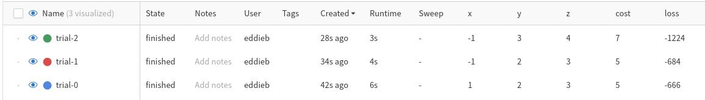
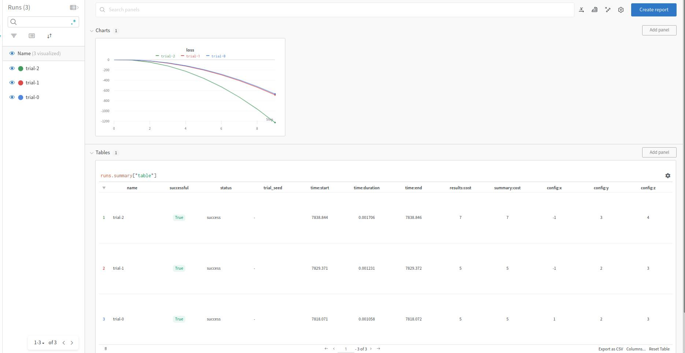

# Weights And Biases
[Weights and Biases](https://www.wandb.com/) is a tool for visualizing and tracking
your machine learning experiments. You can log gradients, metrics, model topology, and
more.

This lets you easily track individual trials during
[optimization](../guides/optimization.md) of your model/pipeline.

While there is no need to explicitly use the plugin, i.e. you can use
wandb however you're used to, we do provide a plugin that tracks
everything that's normally reported on a trial and construct the `run` for
you, making everything that small bit easier.

!!! note "Note"

    You do not need to explicitly use our integration but we automate a lot
    of the process.

!!! warning "Overhead"

    While wandb does not have too much overhead, it does have some. These are
    mostly on the order of 1-2 seconds which can be insignificant for longer
    running trials but can be significant for short running trials. Particularly
    avoid this if you're running many small evaluations.

## Basic Usage without Plugin
To use wandb without the plugin, you can use the following code in your function
you wish to track:

```python hl_lines="8 13 18 20"
import wandb

from amltk import Scheduler, Trial

def target_function(trial: Trial) -> Trial.Report:
    x, y, z = trial.config["x"], trial.config["y"], trial.config["z"]

    run = wandb.init(project="my-project", config=trial.config, name=trial.name)  # (1)!

    with trial.begin():
        for i in range(10):
            loss = (i * x) + 3 * (i * y) - (i * z) ** 2
            run.log({"loss": loss})  # (2)!

    cost = y + z
    trial.summary = {"cost": cost}

    run.summary["cost"] = cost  # (3)!

    run.finish()  # (4)!

    # Finally report the success
    return trial.success(cost=cost)

scheduler = Scheduler.with_processes()

task = Trial.Task(target_function, scheduler)

configs = enumerate(
    [
        {"x": 1.0, "y": 2.0, "z": 3.0},
        {"x": -1.0, "y": 2.0, "z": 3.0},
        {"x": -1.0, "y": 3.0, "z": 4.0},
    ],
)


@scheduler.on_start()
def launch() -> None:
    i, config = next(configs)
    trial = Trial(name=f"trial-{i}", config=config)
    task(trial)


@task.on_report
def launch_next(_: Trial.Report) -> None:
    i, config = next(configs, (None, None))
    if config is not None:
        trial = Trial(name=f"trial-{i}", config=config)
        task(trial)


scheduler.run()
```

1. Create a wandb run as you normally would with `init()`.
2. Log custom metrics.
3. Log any summary metrics.
4. Make sure to tell `wandb` that you've finished the run.

This will create some basic wandb output for you



!!! note "One Run Per Process"

    You can only create one run per Process as per
    [wandb documentation.][https://docs.wandb.ai/guides/track/log/distributed-training#method-2-many-processes]
    When you use any [`Scheduler`][amltk.scheduling.Scheduler] that utilizes
    multiple processes, you should be fine, the one notable exception
    is using a Scheduler with threads.

## Basic Usage with Plugin
To use the wandb plugin, the only thing we need to do is create a
[`WandbPlugin`][amltk.wandb.WandbPlugin] and attach it to the actual
[`Trial`][amltk.Trial] with the following:

```python hl_lines="3 4 5 6 7 8 13"
from amltk.wandb import WandbPlugin

wandb_plugin = WandbPlugin(
    project="amltk-test2",
    group=...,
    entity=...,
    mode=...,
)

task = Trial.Task(
    target_function,
    scheduler,
    plugins=[wandb_plugin.trial_tracker()],
)
```

These lines above will automatically attach the wandb run to the trial under
`.plugins["wandb"]` if you need to access it explicitly.

Finally, to use it, this function is much like the previous but with many of the
steps automated for you, adding in additonal information.

```python hl_lines="5 10 13"
def target_function(trial: Trial) -> Trial.Report:
    x, y, z = trial.config["x"], trial.config["y"], trial.config["z"]

    # The plugin will automatically attach the run to the trial
    run = trial.plugins["wandb"]

    with trial.begin():
        for i in range(10):
            loss = (i * x) + 3 * (i * y) - (i * z) ** 2
            run.log({"loss": loss})  # (1)!

    cost = y + z
    trial.summary = {"cost": cost}  # (2)!

    # Will automatically log the report to the run and finish it up
    return trial.success(cost=cost)
```
1. You can still manually log what you like to the run as you normally would do
 with weights and biases.
2. Any numeric values stored in the summary will be automatically put in the
 summary report of the `wandb.Run`.


This will additionally report a lot of the metric generated in the report for further
possible analysis.



## Advanced Usage
Weights and biases gives you the ability to tag, add notes and additionally mark
specific runs.
To do so, you can pass in a function to modify the
[`WandbParams`][amltk.wandb.WandbParams] that are used to create the run.

The below example will add tag runs based on if the `x` value is positive or negative.

!!! example "Modifying the run"

    ```python hl_lines="1 2 3 9"
    def modify_run(trial: Trial, params: WandbParams) -> WandbParams:
        tags = ["positive"] if trial.config["x"] > 0 else ["negative"]
        return params.modify(tags=tags)

    # Later
    task = Trial.Task(
        target_function,
        scheduler,
        plugins=[wandb_plugin.trial_tracker(modify=modify_run)],
    )
    ```

## More
If you'd like to see more functionality, we'd love to hear from you, please
open an issue on our Github or submit a PR!
